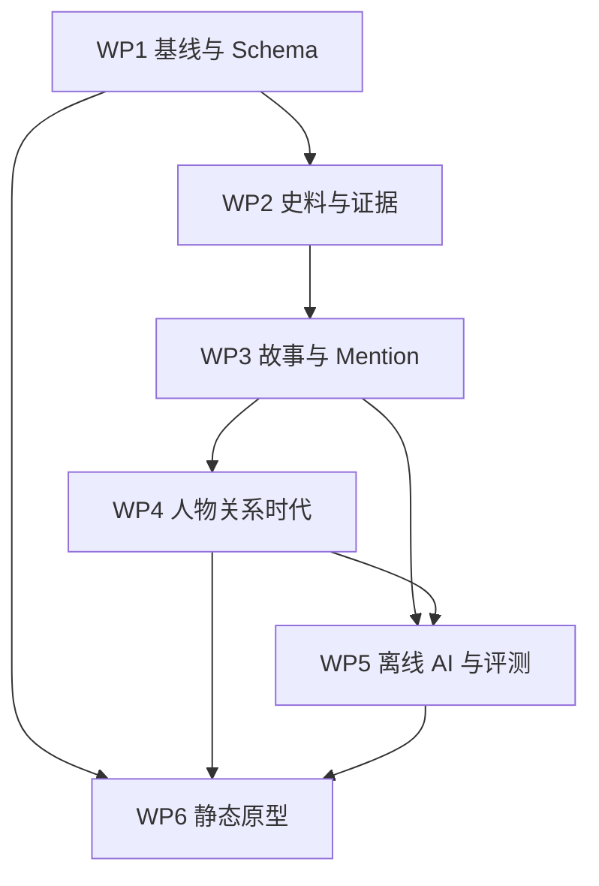

# 世说 Sketch

## Milestone 1 开发任务说明

**版本**：v0.1  
**状态**：开发基线  
**适用范围**：WP1–WP6  
**项目目标**：通过一个小规模、可核验、可漫游的原型，把读者从“读故事但认不清人、理不清关系、感受不到时代”的困惑中带出来。

## 1. Milestone 1 的目标

Milestone 1 不追求完成《世说新语》全库，也不追求一次性建立完整知识图谱。它只验证一条最小可用闭环：

> 读一则故事 → 认出人物 → 查看人物素描 → 沿关系移动 → 阅读相关故事 → 获得一小段时代背景。

### 1.1 范围

| 项目 | Milestone 1 目标 |
|---|---|
| 核心人物 | 6 位，形成一个可解释的核心人物集合 |
| 故事规模 | 15–30 则，优先选择人物关系和时代信息密度较高的故事 |
| 产品形态 | Story Reader、Person Sketch、Relation View、Era Sketch 的静态原型 |
| 数据轨道 Track A | 形成可浏览、可跳转的最小产品闭环 |
| 数据轨道 Track B | 完成 Mention、Relation、Story Metadata 标注及小型语义评测集 |
| AI 使用方式 | 仅作为离线构建和辅助标注依赖；生成结果必须人工审核并保留证据 |
| 部署方式 | static-first；运行时不依赖在线 LLM、数据库或 Neo4j |

### 1.2 明确不做

- 不在 Milestone 1 内覆盖全书、全人物或完整魏晋家族网络。
- 不把未经史料支持的模型推断直接写入人物和关系页面。
- 不在前端运行在线大模型，不把用户请求转发到第三方 LLM。
- 不以 Neo4j 或复杂后端服务作为原型的必要条件。
- 不先做复杂推荐系统、社交功能、账号体系和移动端 App。
- 不把“模型生成了文本”当作交付标准；可追溯、可复核和可阅读才是交付标准。

## 2. 完成定义（Definition of Done）

Milestone 1 通过验收需要同时满足以下条件：

1. 6 位核心人物、15–30 则故事均有稳定 ID、来源记录和版本信息。
2. 每则故事至少具备：原文、可读标题、简要摘要、人物提及、时间/地点信息（若可确定）、来源定位和不确定性标记。
3. 每一条人物关系都能回溯到至少一条故事或其他明确史料证据；推测性关系必须显式标记为 `inferred`，不能伪装成史实。
4. 用户可以从任意故事进入人物页，再进入关系或相关故事，且所有链接可直接访问。
5. Era Sketch 至少能说明初始材料所属的时代范围、主要社会结构和人物活动背景，不以百科式长文替代阅读路径。
6. 离线构建流程能够重复运行，输出数据、搜索结果和静态页面；前端构建过程不访问在线 LLM。
7. Track B 的小型语义评测集、人工校对记录和已知问题清单已提交。
8. 新环境能够按照 README 完成数据校验和静态构建，且构建失败时能定位到具体数据或脚本错误。

## 3. 总体技术路线

```text
史料/版本
   ↓
原始数据与证据登记
   ↓
故事切分、人物 Mention、结构化标注
   ↓
Person / Relation / Era 数据模型
   ↓
离线 AI 辅助抽取、摘要、向量化与语义评测
   ↓
静态 JSON 数据包与预计算关联结果
   ↓
Story Reader / Person Sketch / Relation View / Era Sketch
```

### 3.1 推荐的数据分层

| 层级 | 内容 | 是否允许直接修改 |
|---|---|---:|
| `raw` | 原始史料、版本文本、扫描件或来源快照 | 否；新增版本而非覆盖 |
| `normalized` | 标点、分段、异体字和格式统一后的文本 | 需保留处理记录 |
| `annotation` | 人物提及、关系候选、故事元数据、人工判断 | 是，但必须版本化 |
| `derived` | 摘要、向量、相关故事、页面所需索引 | 可重新生成 |
| `site` | 前端消费的静态 JSON、HTML、资源 | 不手工编辑 |

### 3.2 稳定 ID 规则

建议使用不随标题或文本变化的 ID：

```text
source_001
story_001
person_001
mention_001
relation_001
era_001
```

标题、别名、现代译写和页面 URL 均不得作为主键。每次 AI 重跑不得重新生成已有实体的 ID。

## 4. 六个工作包

## WP1：项目基线、数据模型与开发骨架

### 目标

把产品设想转化为可执行的工程约束，建立数据 Schema、目录结构、校验脚本和静态原型骨架，使后续数据和页面可以并行开发。

### 任务清单

| 编号 | 开发任务 | 主要产出 | 优先级 |
|---|---|---|---:|
| WP1-T01 | 冻结 Milestone 1 人物、故事和初始时代范围；建立 `scope` 和 `manifest` | `docs/scope.md`、内容清单 | P0 |
| WP1-T02 | 定义 Source、Story、Person、Mention、Relation、Era、Evidence 数据 Schema | `schema/*.json` 或等价类型定义 | P0 |
| WP1-T03 | 建立稳定 ID、别名、时间、地点、不确定性和证据状态的编码规则 | `docs/data-conventions.md` | P0 |
| WP1-T04 | 初始化仓库目录、开发环境、格式化和数据校验命令 | `README`、`scripts/validate` | P0 |
| WP1-T05 | 确定 static-first 前端接口：页面路由、静态 JSON 结构和构建入口 | 前端骨架、数据接口说明 | P0 |
| WP1-T06 | 建立 ADR 和变更记录，记录数据模型与范围变更原因 | `docs/adr/`、`CHANGELOG` | P1 |

### 最小数据对象

| 对象 | 必要字段 |
|---|---|
| Source | `id`、版本/出版信息、来源类型、定位方式、许可或使用说明 |
| Story | `id`、标题、原文、摘要、来源、人物 Mention、时间/地点、审核状态 |
| Person | `id`、姓名、别名、身份标签、活动时期、简介、证据列表 |
| Mention | `id`、`story_id`、`person_id`、原文位置、识别状态、置信度 |
| Relation | `id`、主体、客体、关系类型、有效时期、证据、断言状态 |
| Era | `id`、时间范围、主题、背景摘要、关联人物/故事、来源 |
| Evidence | `source_id`、章节/页码/段落定位、原文锚点、说明、审核人 |

### 完成标准

- 空仓库可运行数据校验命令并输出清晰错误。
- 至少有 1 个示例 Story、Person、Relation 和 Era 数据通过校验。
- Schema 能区分 `attested`（有直接证据）、`reported`（来源转述）、`inferred`（研究性推断）和 `unknown`（未知）。
- 前端可以读取一份最小静态 JSON 并渲染占位页面。

### 依赖

无。WP1 是所有其他工作包的入口。

## WP2：史料采集、版本管理与证据链

### 目标

建立 Milestone 1 的小型、可追溯史料底座。每个故事和每项关键人物/关系判断都能回答“来自哪一个版本、哪一处文字、经过了什么处理”。

### 任务清单

| 编号 | 开发任务 | 主要产出 | 优先级 |
|---|---|---|---:|
| WP2-T01 | 为 6 位人物和候选故事建立史料优先级清单 | `source-catalog.csv`、候选清单 | P0 |
| WP2-T02 | 收集原文、版本信息和可公开使用的辅助材料 | `data/raw/` | P0 |
| WP2-T03 | 记录章节、页码、段落或网址等可复核定位信息 | `data/sources/` | P0 |
| WP2-T04 | 对原文进行分段、标点和格式规范化，保留原始版本 | `data/normalized/` | P0 |
| WP2-T05 | 为每项事实建立 Evidence 记录，区分直接记载、转述和推断 | `data/evidence/` | P0 |
| WP2-T06 | 编写史料采集与引用规范，明确不能使用的无来源网络内容 | `docs/source-guideline.md` | P1 |

### 证据规则

- 原文和现代摘要分开存储；摘要由项目成员自行撰写或由离线模型生成后人工改写。
- 现代译文、网络文章和二手解释只能作为辅助线索，不能在没有核对原始出处时直接进入事实层。
- 如果不同版本存在异文，保留版本差异，并在 Story 中标记 `variant`，不要静默合并。
- 不能确定的年代、亲属关系或事件因果关系使用 `unknown` 或 `inferred`，同时写明判断依据。

### 完成标准

- 纳入 15–30 则故事，形成候选集和最终集两个清单。
- 每则最终故事都有至少一个 Source 和一个可定位 Evidence。
- 100% 的人物、时间、地点和关系字段都可以追溯到证据或明确标记为未知/推断。
- 原始数据不会被规范化脚本覆盖，处理过程可以重新运行。

### 依赖

WP1 的 Schema、ID 和范围清单。

## WP3：故事结构化、人物提及与人工标注

### 目标

将原始故事转化为可被前端、关系模型和离线 AI 使用的结构化数据，并建立一份小而可靠的人工标注集，作为后续自动化的基准。

### 任务清单

| 编号 | 开发任务 | 主要产出 | 优先级 |
|---|---|---|---:|
| WP3-T01 | 制定故事切分、标题、摘要和段落锚点规则 | `docs/annotation-guideline.md` | P0 |
| WP3-T02 | 标注故事中的人物 Mention，并链接到 Person ID | `mentions.jsonl` | P0 |
| WP3-T03 | 标注故事元数据：人物角色、行为、时间、地点、主题和叙事状态 | `stories.jsonl` | P0 |
| WP3-T04 | 标记同名、异名、称谓、代词和无法消歧的 Mention | `ambiguity` 字段及问题清单 | P0 |
| WP3-T05 | 对核心样本进行双人复核或交叉复核，记录分歧 | `review-log.csv` | P1 |
| WP3-T06 | 生成用于前端的可读摘要和用于检索的文本字段 | `derived/story-text.jsonl` | P0 |

### 标注原则

- 先标“文本中明确出现的内容”，再标“基于上下文的合理解释”；两者不能混在同一个无状态字段中。
- 每个 Mention 必须保留原文起止位置或可复现的文本锚点。
- 人物消歧失败时保留候选集，不强行选择一个 Person。
- 故事摘要应帮助读者进入情境，不应加入原文没有支持的心理动机。
- 标注文件与生成文件分离；前端只读取经过校验的构建产物。

### 完成标准

- 所有最终故事都有结构化对象、摘要和人物 Mention。
- 6 位核心人物在至少一则故事中有可定位 Mention。
- 至少 20% 的故事进入人工复核集；复核结果和 unresolved 问题已记录。
- Mention 的原文锚点、Person ID 和 Story ID 均通过一致性检查。

### 依赖

WP1、WP2。WP3 的人工标注结果是 WP4 和 WP5 的主要输入。

## WP4：人物—关系—时代知识模型

### 目标

将故事中的人物信息组织成三种互相连接但不互相替代的视图：人物素描、关系视图和时代素描。重点是让读者能够沿关系阅读，而不是一开始就展示一张难以解释的大图。

### 任务清单

| 编号 | 开发任务 | 主要产出 | 优先级 |
|---|---|---|---:|
| WP4-T01 | 定义关系类型及其边界，如亲属、师友、政治关联、文学交往、对立等 | `relation-types.yml` | P0 |
| WP4-T02 | 从故事和证据中建立关系候选，人工确认主体、客体和方向 | `relations.jsonl` | P0 |
| WP4-T03 | 为人物建立最小 Person Sketch：身份、时期、活动范围、性格线索和代表故事 | `persons.jsonl` | P0 |
| WP4-T04 | 建立 Era Sketch：时间范围、社会结构、制度/文化背景和材料边界 | `eras.jsonl` | P0 |
| WP4-T05 | 为关系增加有效时期、证据、强度/状态和不确定性字段 | Relation schema 扩展 | P0 |
| WP4-T06 | 生成局部邻接数据和人物关系摘要，供前端静态读取 | `derived/graph/*.json` | P0 |

### 建模规则

- 关系边必须携带证据，不允许仅因两人同时出现在同一故事中就自动建立关系。
- “关系存在”和“关系性质”分开表达；例如同一对人物可以同时存在亲属关系和政治对立。
- 时间是关系的一部分。没有足够依据时不填精确年份，可使用时期或 `unknown`。
- Person Sketch 是“基于材料的素描”，不是人物百科；所有性格判断都必须有故事依据或明确的解释标签。
- Era Sketch 只提供阅读所需的最小背景，避免在 Milestone 1 中扩展为完整通史数据库。

### 完成标准

- 6 位核心人物均有 Person Sketch 页面数据。
- 所有进入前端的关系边均可回溯到 Evidence。
- 至少形成一个包含 3 位以上人物的局部关系网络，并能从任意节点回到故事。
- 至少 1 个 Era Sketch 能够被 3 则以上故事引用，且不与故事时间范围冲突。
- 图数据通过孤儿节点、反向边、重复边和无证据边检查。

### 依赖

WP1、WP2、WP3。

## WP5：离线 AI 构建流水线与语义基准

### 目标

利用实验室 GPU 服务器上的离线模型降低整理和检索成本，同时把 AI 限定为可重复、可审计的构建工具。网站运行时不依赖模型服务。

### 任务清单

| 编号 | 开发任务 | 主要产出 | 优先级 |
|---|---|---|---:|
| WP5-T01 | 评估本地中文生成模型和 embedding 模型，确定 M1 基线 | `docs/ai-baseline.md` | P0 |
| WP5-T02 | 实现批处理：文本清洗辅助、人物候选、摘要草稿和关系候选生成 | `pipelines/extract/` | P0 |
| WP5-T03 | 设计受 Schema 约束的提示词/解码格式，处理失败重试和非法 JSON | `prompts/`、解析器 | P0 |
| WP5-T04 | 记录模型版本、参数、提示词版本、输入哈希和输出状态 | `runs/`、`run-manifest.json` | P0 |
| WP5-T05 | 构建离线向量化和相关故事预计算流程 | `pipelines/retrieve/`、`derived/related.json` | P0 |
| WP5-T06 | 建立小型语义评测集，并与关键词检索 baseline 比较 | `benchmarks/`、评测报告 | P0 |
| WP5-T07 | 对 AI 输出进行人工审核、回写证据和记录拒绝原因 | `review/ai-review.csv` | P0 |

### 技术约束

- 使用三块 L40 GPU 时采用批处理和可恢复任务；单块 GPU 也应能运行小规模样本。
- 模型输出只能产生 `candidate` 或 `draft`，通过人工审核后才升级为正式数据。
- 对摘要、关系和人物属性分别保存来源文本、模型输出和人工修订结果。
- embedding、相关故事和页面索引在构建阶段生成，前端只读取结果。
- 模型、提示词、随机种子和输入版本必须写入运行清单，以便复现和比较。

### 评测指标

| 指标 | 用途 | Milestone 1 要求 |
|---|---|---:|
| Schema 合法率 | 检查模型输出是否可进入流水线 | 100% 经解析器处理；失败样本可定位 |
| 证据覆盖率 | 检查摘要/关系是否有原文依据 | 进入正式数据的记录为 100% |
| Mention 识别质量 | 检查人物提及候选 | 在人工 gold set 上达到可接受水平，并记录 Precision/Recall/F1 |
| Related Story Recall@5 | 检查语义关联是否有用 | 目标 ≥ 0.80；同时报告关键词 baseline |
| 人工采纳率 | 衡量 AI 是否真正降低成本 | 作为观察指标，不作为唯一质量标准 |

若某项指标未达到目标，不得隐藏结果；应保留 baseline、失败样本和下一步改进建议。

### 完成标准

- 在无网络条件下能够完成一批故事的抽取、向量化和静态数据生成。
- 所有正式写入数据的 AI 辅助结果都有人工审核状态和证据定位。
- 评测集、baseline、指标结果和失败案例已提交。
- 前端构建不需要启动 LLM 服务，也不会暴露模型接口或 API Key。

### 依赖

WP1、WP2、WP3；WP4 的关系类型和人物数据可以作为后续增强输入。

## WP6：Static-first Story Reader 与端到端集成

### 目标

把 Track A 的数据和 Track B 的质量成果组装成一个可实际体验的原型，验证“故事—人物—关系—相关故事—时代”的阅读路径。

### 任务清单

| 编号 | 开发任务 | 主要产出 | 优先级 |
|---|---|---|---:|
| WP6-T01 | 建立静态路由和页面骨架：故事、人物、关系、时代、关于/来源 | 前端路由与布局 | P0 |
| WP6-T02 | 实现 Story Reader：原文、摘要、人物高亮、证据入口和相关故事 | Story Reader 页面 | P0 |
| WP6-T03 | 实现 Person Sketch：基本身份、故事轨迹、关系入口和不确定性提示 | Person 页面 | P0 |
| WP6-T04 | 实现 Relation View：局部关系、关系类型、时间范围、证据和回跳 | Relation 页面/组件 | P0 |
| WP6-T05 | 实现 Era Sketch：时代背景、关联人物、关联故事和材料范围说明 | Era 页面/组件 | P0 |
| WP6-T06 | 接入预计算的相关故事和静态图数据，处理空值、歧义和断链 | 数据适配层 | P0 |
| WP6-T07 | 完成响应式布局、键盘访问、移动端阅读和直接 URL 访问 | 可用性修订 | P1 |
| WP6-T08 | 执行端到端验收：从任意故事走完一条阅读闭环 | 验收记录、问题清单 | P0 |

### 交互原则

- 首屏以故事和人物为主，不以复杂关系图作为入口。
- 关系图默认展示局部邻域，读者需要时再展开，避免“毛线团式”信息噪声。
- 事实、解释和推断使用不同的视觉状态，并提供来源入口。
- 时代信息嵌入阅读路径，长度控制在帮助理解当前故事所需的范围内。
- 所有页面都应能回到上一步阅读位置或继续进入下一则故事。

### 完成标准

- 15–30 则故事、6 位人物和至少 1 个 Era Sketch 均可通过静态页面访问。
- 至少完成以下用户路径测试：

  ```text
  Story Reader → Person Sketch → Relation View → Related Story → Era Sketch
  ```

- 页面刷新、复制链接和直接打开深层 URL 不会丢失内容。
- 构建过程无在线 LLM、数据库或运行时 API 依赖。
- 发现的断链、空数据、证据缺失和文案问题均进入问题清单并有处理状态。

### 依赖

WP1 的前端接口、WP3 的 Story/ Mention 数据、WP4 的 Person/Relation/Era 数据、WP5 的派生数据。

## 5. 工作包依赖与并行关系



### 并行策略

- WP1 完成 Schema 草案后，WP2 可以开始采集；不必等待全部工程骨架完成。
- WP3 的标注和 WP6 的页面骨架可以并行，但页面只能依赖稳定的字段定义，不应依赖尚未确定的具体内容。
- WP5 先用 3–5 则样本做 pipeline smoke test，再等待完整 15–30 则数据。
- WP4 的关系类型在早期冻结，关系边可以随着 WP3 标注逐步补齐。
- WP6 最后两周做集成，但 Story Reader 和通用组件应尽早用 mock data 验证。

## 6. 建议排期：8 周

| 周期 | 重点工作 | 里程碑 |
|---|---|---|
| 第 1 周 | WP1-T01–T05；确定人物/故事清单和 Schema | G0：范围与数据模型冻结 |
| 第 2 周 | WP2-T01–T04；建立原始和规范化数据；WP6 页面骨架 | 史料样本可读取 |
| 第 3 周 | WP2-T05–T06；WP3-T01–T03；WP5-T01–T03 | G1：3–5 则样本端到端跑通 |
| 第 4 周 | 完成主要故事标注；开始 Person/Relation 建模 | 故事数据 v0.1 |
| 第 5 周 | WP4-T02–T06；WP5-T04–T06；前端接入真实数据 | G2：人物关系与检索数据可用 |
| 第 6 周 | 完成 6 人、15–30 故事的数据冻结；完善 Story Reader 和 Person Sketch | Track A 主路径可走通 |
| 第 7 周 | 完成 Relation View、Era Sketch、证据入口和异常处理 | G3：原型功能冻结 |
| 第 8 周 | 端到端测试、内容复核、构建复现、问题清理 | G4：Milestone 1 验收 |

若只有一名开发者，建议将排期延长为 10–12 周，但不扩大内容规模。

## 7. 推荐目录结构

```text
docs/
  milestone-1-development-tasks.md
  scope.md
  data-conventions.md
  annotation-guideline.md
  source-guideline.md
  ai-baseline.md
  adr/
schema/
data/
  raw/
  normalized/
  sources/
  evidence/
  annotation/
  derived/
benchmarks/
pipelines/
  ingest/
  extract/
  retrieve/
scripts/
site/
  public/
  src/
  tests/
```

目录可根据实际框架调整，但必须保持“原始数据、人工标注、派生数据、前端构建产物”分离。

## 8. 质量门禁

每次合并或构建至少执行：

```text
1. Schema 校验
2. ID 唯一性和引用完整性检查
3. Evidence 覆盖率检查
4. Story–Person–Relation–Era 反向链接检查
5. AI 输出中 candidate/draft 未误写入正式数据检查
6. 静态构建和深层 URL 检查
7. 语义评测集回归检查
```

任何“没有来源”“人物 ID 不确定但已强行链接”“静态页面依赖在线服务”的问题都属于 P0 阻塞问题。

## 9. Milestone 1 结束时的交付包

1. 项目 README 和本开发任务文档。
2. 数据 Schema、命名规则、来源规范和标注指南。
3. 6 位人物、15–30 则故事及其 Evidence 数据。
4. Person、Relation、Era 的结构化数据和静态派生索引。
5. 离线 AI 构建脚本、运行清单、评测集和评测报告。
6. 可直接构建的 Story Reader 原型及端到端验收记录。
7. 未解决问题清单：史料争议、人物消歧、关系推断、模型失败样本和前端断链。

## 10. 开工顺序

第一天不应从页面视觉细节开始，而应完成以下四项：

1. 建立 6 位人物和 15–30 则候选故事的 manifest。
2. 定义 Story、Person、Mention、Relation、Evidence 的最小 Schema。
3. 选取 3 则代表性故事，跑通“原始文本 → 标注 → 静态 JSON → 页面”的样本闭环。
4. 用样本闭环暴露字段缺失，再冻结 v0.1 数据模型。

样本闭环通过后，再扩大到完整数据集。这样可以把 Milestone 1 的主要风险尽早集中到可验证的工程问题上，而不是在全量资料整理完成后才发现模型或页面接口不成立。
